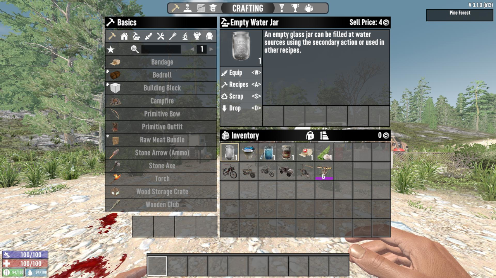
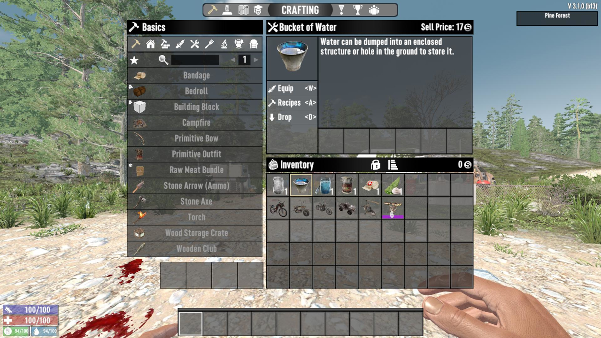

# Add Equip Shortcut

A mod for 7 Days to Die.

This mod adds an "Equip" shortcut to a wider range of items.

**Supported Items:**

- **Vehicles:** All vehicles and drones
- **Consumables:** Food and medical supplies
- **Containers:** Empty Water Jars and Water Buckets

_Note: For items that double as crafting ingredients (e.g., Aloe Cream), the "Recipes" shortcut will be assigned to the "S" key._

